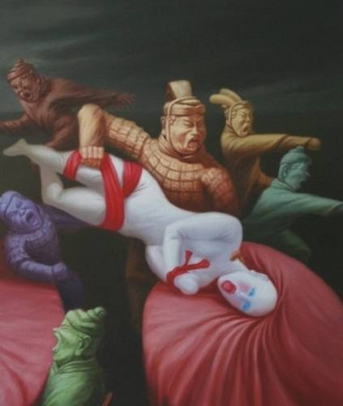

### 发现一处“卧槽
http://suzhanjun.blog.sohu.com/113928892.html

女神、老 毛、兵马俑——作者：赵朔

兵马俑——作者：赵朔

我们只有一个地球——作者：陈秋池

家——作者：李永生
`鸡占80%，吃肉下蛋。狗占20%，看家护院`
### 兵马俑大战自由女神，你会说什么？
http://tieba.baidu.com/p/1644728528

