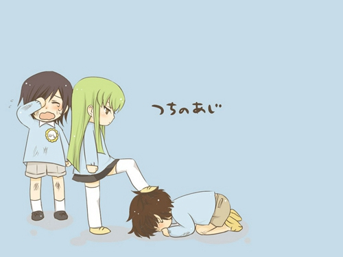

### c
* c是CreatureSCloud人云
* 6cc是Sicks CreatureS Cloud病弱的人云
  * http://6cc.github.io
* 理解成病弱的CC也没差

* CreatureS万物
* Cloud云
* Civilization
* Culture
* Cross absorption
* Collect
* Calculate【Gottfried LeibnizLet us calculate.】
* Clear up
* Check
* Consider
* Cure
* Cooperating
* COMMUNIcateSM
